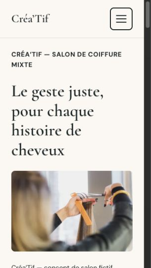

# Revue UX — Créa’Tif : passe photographique

**Date :** 7 septembre 2026 — **Agent :** codex-ui-ux.

**Commit audité :** `1d59fef160c785a1c3b785dd8d795b5ae384b40f` sur `main`, après `git pull --ff-only origin main`. Livraison : « intègre les sept photographies d’illustration ». Une seconde synchronisation avant rédaction confirme ce même commit.

**Référence :** [DIRECTION.md — Direction artistique](DIRECTION.md), sélection P01–P07 et brief validés par Simon, finalisés dans `9456bb7e75337b89cabbf96722e8a2b968e51fc5`. Cette revue porte sur leur intégration visible, pas sur une nouvelle sélection.

## Verdict ciblé

**Avis UI/UX favorable sur la passe photographique pour un portfolio conceptuel. Aucune correction visuelle indispensable constatée dans le périmètre testé. La validation finale du rendu appartient à Simon et reste à obtenir.**

Le site évoque désormais immédiatement un salon de coiffure : mains, ciseaux, peigne et cheveux sont reconnaissables dès le premier écran d’accueil, y compris sur les quatre petits viewports prescrits. Le rendu gagne nettement en crédibilité par rapport aux grandes compositions abstraites. Le hero Coiffure conserve le 3:2 sur tablette, avec les transitions attendues aux bornes 599/600 et 899/900 px.

La série est cohérente pour une démonstration éditoriale chaleureuse et contemporaine. Elle reste identifiable comme une sélection de photographies d’illustration, et non comme un reportage exclusif sur un même établissement. C’est une limite d’originalité, pas un défaut d’intégration ni un motif suffisant pour relancer l’identité.

## 1. Corrections indispensables

**Aucune demande corrective bloquante sur les points visuels effectivement examinés.**

- Les sept sujets approuvés et leurs destinations sont respectés.
- Aucun recadrage observé ne fait disparaître le geste ou le sujet nécessaire à la compréhension du métier.
- Les quatre critères chiffrés du premier écran d’accueil sont satisfaits après chargement des polices et des images.
- Les photographies ne passent pas derrière les textes informatifs, les boutons ou les coordonnées ; le panneau desktop d’accueil est bien opaque.
- Les mentions d’illustration et les crédits restent visibles en texte sur fond uni. Il n’y a pas de galerie de prétendues réalisations ni de portrait nommé ajouté.

Cette absence de correction indispensable ne constitue ni un audit fonctionnel complet, ni une certification d’accessibilité, ni une validation des droits tiers.

## 2. Préférences facultatives

| Point | Observation | Suite éventuelle, non bloquante |
| --- | --- | --- |
| Libellé des crédits | Le chemin `assets/photos/NOTICE.md` est affiché dans les quatre pieds de page. Il est lisible, mais donne une finition technique à une interface destinée au visiteur. | Un intitulé « Crédits et licences photographiques », conservant la même destination, serait plus soigné. Aucun nouveau composant nécessaire. |
| P07, texture et nuances | Le fond plus froid et le point de vue documentaire s’écartent légèrement du flou lumineux des scènes de gestes. L’image apporte néanmoins une texture différente et reste bien intégrée sur les aplats. | Acceptable telle quelle. Ne pas demander un remplacement, un filtre chaud systématique ou une recoloration des cheveux pour homogénéiser artificiellement la série. |

Les cartes d’univers restent de la même famille graphique : leur distinction repose maintenant principalement sur les photos et les contenus. C’est suffisant dans le rendu observé ; ajouter des ornements ou surassombrir Barbier ne serait pas une amélioration nécessaire.

## 3. Arbitrages à soumettre à Simon

1. **Validation finale du rendu photographique :** confirmer, à partir des captures ci-dessous, que cette identité illustrative est suffisamment aboutie pour le portfolio. L’agent recommande l’acceptation sur le plan visuel ; l’accord antérieur sur P01–P07 ne remplace pas cette décision.
2. **Finition des crédits :** conserver le libellé technique actuel ou demander la petite retouche facultative ci-dessus. Ce choix n’empêche pas l’acceptation esthétique.
3. **Réserve existante avant diffusion :** cette revue ne lève pas les limites de droits tiers inscrites dans le brief, notamment pour le modèle partiellement reconnaissable de P06. Aucun document individuel d’autorisation n’a été contrôlé ici. La décision de diffusion et le traitement de cette réserve restent distincts de l’avis visuel ; aucune substitution photographique n’est décidée par cette revue.

**P04 n’est pas un nouvel arbitrage à rouvrir :** le compromis brique/atelier a déjà été accepté. Il reste limité à l’image du salon et ne contamine ni la navigation ni le langage graphique de la marque.

## 4. Périmètre, méthode et limites des preuves

Inspection du site réellement servi en local et affiché dans le navigateur intégré à Codex : accueil, Coiffure, Barbier et Le salon. Lecture des pages entières, des photos, des textes associés et des pieds de page. Les mesures proviennent des rectangles des images dans le DOM rendu, en complément de l’observation visuelle ; ce ne sont pas des dimensions déduites du CSS ou des tests annoncés par Claude.

- **Quatre pages :** 375 × 667, 768 × 1024 et 1440 × 900 px ; contrôle complémentaire des recadrages à 320 × 568 px.
- **Accueil, premier écran :** 320 × 568, 375 × 667, 390 × 844 et 375 × 550 px, menu fermé, sans défilement.
- **Bornes Coiffure :** 599 × 1024, 600 × 1024, 899 × 1024 et 900 × 1024 px.
- Dimensions en **pixels CSS**, largeur × hauteur, hors interface du navigateur. État des polices : `loaded` ; Cormorant Garamond pour les titres et DM Sans pour les textes, avec contrôles de disponibilité positifs dans le navigateur. Les captures retenues montrent les images chargées.

**Précaution de lecture :** ce navigateur réserve 15 px à la barre verticale : à 375 px de viewport, la largeur de mise en page mesurée est 360 px. Cela explique une P01 de 312 × 208 px, au lieu des 327 × 218 px indicatifs du brief sans cette barre. Les fichiers de premier écran peuvent être redimensionnés par l’outil de capture : leurs pixels bitmap ne doivent pas être assimilés aux pixels CSS. Les vues complètes `-page` peuvent supprimer la barre lors de la capture et déplacer certains retours à la ligne ; elles documentent la composition d’ensemble, **pas les seuils du premier écran**, vérifiés séparément dans le viewport rendu. Aucun visuel n’a été retouché pour la revue.

**Non retestés :** menu et parcours clavier, zoom 200 % et agrandissement système des textes, lecteurs d’écran, autres navigateurs et appareils physiques, fonctionnement des contacts et des liens externes, performance/CLS/réseau lent, SEO, licences ou autorisations individuelles. Aucun résultat annoncé dans le commit de Claude n’est repris comme une vérification effectuée par cet agent.

## 5. Conformité de la série P01–P07 et des cadrages

| Photo | Destination observée | Constat visuel aux formats contrôlés |
| --- | --- | --- |
| **P01 — Coupe en cours** | Fond du hero d’accueil sur desktop ; photo de contenu entre H1 et introduction sous 900 px | Mains, ciseaux, peigne et mèche restent associés. Sur desktop, l’action est lisible à droite du panneau Ivoire ; le premier plan flou ne devient pas le sujet. Sur petit mobile, la photo n’est pas réduite à un filet décoratif. |
| **P02 — Brushing et matière** | Carte Coiffure sur l’accueil et hero Coiffure | Brosse, mèche et embout du sèche-cheveux reconnaissables. Les cadres verticaux resserrent la scène autour de l’outil ; le 3:2 tablette redonne de l’air autour du geste. La carte reste compréhensible à 320 px. |
| **P03 — Finition d’une coupe courte** | Carte Barbier sur l’accueil et hero Barbier | Nuque, ligne de coupe et outils à gauche restent ensemble dans le 3:2. Les noirs rendent l’univers plus dense sans effacer le travail ni introduire de codes vintage. |
| **P04 — Espace de soin** | Un seul bandeau d’ambiance sur Le salon | Les deux bacs et la plante identifient le métier. Le 16:9 desktop coupe davantage le bas du mobilier, sans sacrifier les vasques ; le 3:2 mobile/tablette laisse davantage de contexte. La brique reste un décor localisé. |
| **P05 — Précision de la main** | « Le geste juste » sur l’accueil | Plan plus rapproché que P01, avec relation peigne–ciseaux–cheveux lisible, y compris dans le petit cadre à 320 px. Pas de troisième réutilisation du hero ni de nouvelle galerie. |
| **P06 — Entretien de barbe** | « Le détail fait l’équilibre » sur Barbier | Relation main–outil–barbe conservée dans le 3:2. La cape colorée reste partiellement visible : ce compromis est préférable à couper le geste, conformément au brief. Profil partiel et bijoux présents ; aucune conclusion d’anonymat n’est tirée. |
| **P07 — Texture et nuances** | « La couleur se pense aussi à la lumière » sur Coiffure | Texture, plusieurs torsades et pointes brunes visibles. Le 3:2 ne réduit pas l’image à une seule mèche. Contexte illustratif, sans avant/après ni attribution à une coloration réalisée par Créa’Tif. |

**Distinction des univers :** Coiffure met en avant cheveux longs, mouvement et lumière ; Barbier, coupe courte, contours et entretien de barbe. Photos et rythmes de page les différencient sans sépia, patine, accessoires rétro ni mise en scène de barbershop vintage.

**Répétitions :** P02 et P03 servent chacune de repère entre une carte d’accueil et la page correspondante. Aucun cliché répété deux fois sur une même page. Les grandes compositions abstraites désignées ne subsistent pas comme illustrations principales ; les aplats et séparateurs assurent la cohérence.

## 6. Accueil : preuve du premier écran mobile

Mesures à `scrollY = 0`. La hauteur visible est la portion de P01 comprise dans la fenêtre, et non la hauteur du hero entier. L’inspection des captures confirme que cette portion contient réellement le geste.

| Viewport | Haut de P01 | Cadre rendu | Hauteur de photo visible | Exigence et résultat |
| --- | --- | --- | --- | --- |
| [320 × 568](captures/coiffeur-mixte/1d59fef/accueil-320x568-premier-ecran.png) | 361,94 px | 257 × 171,33 px | **171,33 px**, image entière | ≥ 160 px avec geste : **respecté** |
| [375 × 667](captures/coiffeur-mixte/1d59fef/accueil-375x667-premier-ecran.png) | 298,86 px | 312 × 208 px | **208 px**, image entière | P01 entière : **respecté** |
| [390 × 844](captures/coiffeur-mixte/1d59fef/accueil-390x844-premier-ecran.png) | 298,86 px | 327 × 218 px | **218 px**, image entière | P01 entière : **respecté** ; introduction et deux CTA également visibles |
| [375 × 550](captures/coiffeur-mixte/1d59fef/accueil-375x550-premier-ecran.png) | 298,86 px | 312 × 208 px | **208 px**, image entière | ≥ 120 px avec geste : **respecté** |

Le métier est annoncé par le sur-titre, puis démontré par le geste : l’objectif est atteint. À 320 px, le H1 occupe quatre lignes dans le viewport mesuré, sans empêcher la présence photographique demandée. L’ordre visible est bien sur-titre/H1 → photo → mention d’illustration → introduction → CTA. Les boutons nécessitent du défilement sur les fenêtres les plus courtes, compromis explicitement accepté dans le brief ; ils ne sont pas comprimés pour les faire entrer.

À 768 × 1024, P01 est entière en 705 × 470 px. À 1440 × 900, le fond photographique et le panneau occupent environ 642 px de hauteur ; cette légère extension au-delà des 640 px indicatifs respecte le caractère extensible du brief. Les mains et les ciseaux ne sont pas cachés par le panneau.

## 7. Coiffure : horizontal tablette et bornes exactes

Dimensions du **cadre photographique P02**, pas de toute la section hero. Arrondis à deux décimales.

| Viewport | Cadre rendu | Ratio | Résultat |
| --- | --- | --- | --- |
| 320 × 568 | 257 × 321,25 px | 4:5 | Petit mobile préservé ; outils et mèche lisibles après défilement |
| 375 × 667 | 312 × 390 px | 4:5 | Petit mobile préservé |
| [599 × 1024](captures/coiffeur-mixte/1d59fef/coiffure-borne-599x1024.png) | 536 × 670 px | 4:5 | Dernier pixel avant le mode tablette : format vertical attendu |
| [600 × 1024](captures/coiffeur-mixte/1d59fef/coiffure-borne-600x1024.png) | 537 × 358 px | **3:2** | Début de la plage tablette : horizontal respecté |
| [768 × 1024](captures/coiffeur-mixte/1d59fef/coiffure-768x1024-premier-ecran.png) | 705 × 470 px | **3:2** | Horizontal respecté, sans grand bloc vertical réintroduit |
| [899 × 1024](captures/coiffeur-mixte/1d59fef/coiffure-borne-899x1024.png) | 836 × 557,33 px | **3:2** | Fin de la plage tablette : horizontal respecté |
| [900 × 1024](captures/coiffeur-mixte/1d59fef/coiffure-borne-900x1024.png) | 347,86 × 463,81 px | 3:4 | Retour desktop et deux colonnes attendus |
| 1440 × 900 | 489,61 × 652,81 px | 3:4 | Composition latérale desktop préservée |

Les transitions exactes contrôlées sont conformes. Le cadrage vertical desktop est plus serré, mais garde la brosse et l’embout : aucun besoin d’en modifier le point focal n’a été constaté.

**Ne pas confondre les exigences :** à 320 px, les photos d’ouverture de Coiffure et Barbier arrivent après le premier écran ; à 375 px elles commencent en bas de fenêtre. Le texte et les CTA les précèdent, conformément au brief de ces pages. Le critère de photo immédiatement visible avec une hauteur minimale concerne l’accueil, pas toutes les pages.

## 8. Lisibilité, mentions et crédibilité

- **Accueil desktop :** panneau `#FBF8F2`, opacité 1 relevée dans le rendu ; titre et CTA ne dépendent pas de la luminance de la photo. Sous 900 px, ils restent séparés de l’image.
- **Autres pages et cartes :** titres, textes, boutons et légendes sur fonds unis. Aucun chevauchement avec un outil ou un visage ne gêne la lecture dans les vues contrôlées.
- **CTA sombre final :** contraste Ivoire/Encre et bouton à contour lisibles ; aucune photographie ajoutée derrière eux.
- **Mentions :** l’accueil précise le concept fictif et les photos d’illustration ; Coiffure et Barbier ont leur mention près du premier visuel. Le salon indique « lieu non associé à Créa’Tif » sous P04. Sur les petites fenêtres, certaines mentions nécessitent du défilement ; elles ne sont ni cachées dans la photo ni réservées au survol.
- **Crédits :** auteurs/plateformes et liens source présents dans les quatre pieds de page. À 320 px, les lignes se répartissent sans se superposer aux autres contenus. Le corps de 13 px reste lisible, quoique moins confortable que le corps principal ; la mention d’illustration de l’accueil est à 14 px.

Échantillons calculés à partir des couleurs retournées par le navigateur, sur surfaces unies et à l’état de repos :

| Usage contrôlé | Couleurs texte / fond | Contraste |
| --- | --- | --- |
| Texte principal et panneau d’accueil | Encre `#1F292A` / Ivoire `#FBF8F2` | **14,06:1** |
| Bouton Cuivre | Ivoire `#FBF8F2` / Cuivre `#A84F3A` | **5,15:1** |
| Texte secondaire « Nos repères » | Sauge `#61766D` / Ivoire `#FBF8F2` | **4,59:1** |
| Crédits sur footer Sable | Encre `#1F292A` / Sable `#E6DDD0` | **11,09:1** |
| Texte et CTA sur bandeau Encre | Ivoire `#FBF8F2` / Encre `#1F292A` | **14,06:1** |

Ces échantillons dépassent le seuil de 4,5:1 demandé pour le texte. Ils ne constituent pas un contrôle exhaustif de tous les états interactifs et de toutes les associations de couleurs. Palette et polices existantes n’ont pas besoin d’une nouvelle refonte pour accueillir cette série.

## 9. Captures justificatives des quatre pages

Vues complètes pour la composition, les recadrages secondaires, les mentions et les crédits. Les intitulés indiquent le viewport de départ, **pas la hauteur totale du PNG déroulé**. Les preuves de premier écran sont séparées en section 6 ; celles des bornes sont liées en section 7.

| Page | 375 × 667 | 768 × 1024 | 1440 × 900 | Recadrages 320 × 568 |
| --- | --- | --- | --- | --- |
| Accueil | [Capture](captures/coiffeur-mixte/1d59fef/accueil-375x667-page.png) | [Capture](captures/coiffeur-mixte/1d59fef/accueil-768x1024-page.png) | [Capture](captures/coiffeur-mixte/1d59fef/accueil-1440x900-page.png) | [Capture](captures/coiffeur-mixte/1d59fef/accueil-320x568-page.png) |
| Coiffure | [Capture](captures/coiffeur-mixte/1d59fef/coiffure-375x667-page.png) | [Capture](captures/coiffeur-mixte/1d59fef/coiffure-768x1024-page.png) | [Capture](captures/coiffeur-mixte/1d59fef/coiffure-1440x900-page.png) | [Capture](captures/coiffeur-mixte/1d59fef/coiffure-320x568-page.png) |
| Barbier | [Capture](captures/coiffeur-mixte/1d59fef/barbier-375x667-page.png) | [Capture](captures/coiffeur-mixte/1d59fef/barbier-768x1024-page.png) | [Capture](captures/coiffeur-mixte/1d59fef/barbier-1440x900-page.png) | [Capture](captures/coiffeur-mixte/1d59fef/barbier-320x568-page.png) |
| Le salon | [Capture](captures/coiffeur-mixte/1d59fef/salon-375x667-page.png) | [Capture](captures/coiffeur-mixte/1d59fef/salon-768x1024-page.png) | [Capture](captures/coiffeur-mixte/1d59fef/salon-1440x900-page.png) | [Capture](captures/coiffeur-mixte/1d59fef/salon-320x568-page.png) |

Complément : [premier écran d’accueil desktop, panneau opaque et geste dégagé](captures/coiffeur-mixte/1d59fef/accueil-1440x900-premier-ecran.png).

## Historique et suite

La précédente contre-vérification du commit `9f60163` clôturait les réserves sur les compositions provisoires et le ratio du hero Coiffure. Elle ne valait pas validation de cette livraison photographique. Les corrections fonctionnelles déjà clôturées ne sont pas rouvertes.

**Suite recommandée : présentation des captures à Simon pour validation du rendu.** Aucune passe de refonte, recherche photo ni correction fonctionnelle n’est demandée par cette revue. Seuls ce rapport et ses captures justificatives sont ajoutés/modifiés ; ni le site ni le brief artistique ne sont changés.
